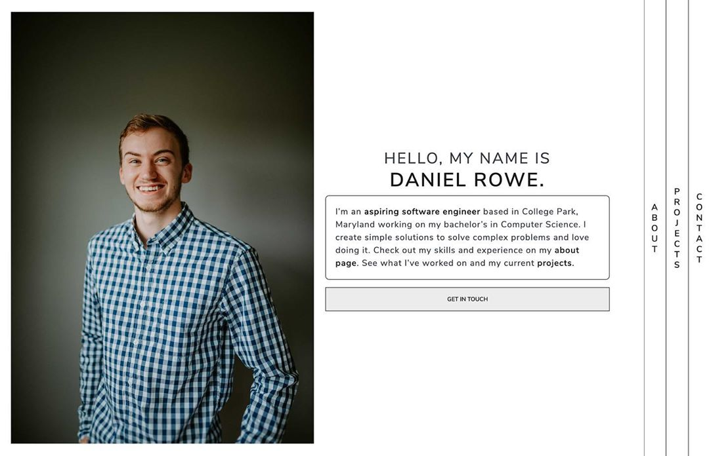

# Daniel Rowe's Developer Portfolio

Hi my name is Daniel, a full stack web developer, data science beginner, and a Computer Science Major at the University of Maryland. This is my portfolio! 

Major improvements to come soon.

This website is in its very early stages but will have a blog up and running once the inital pages have been constructed.

## View Portfolio Here

* https://drowe.dev/

## Built with

* ReactJS
* NodeJS
* JavaScript
* CSS
* Gatsby
* Bootstrap

## Contributing

Please open an issue first to discuss what you would like to change.

## License

[MIT](https://choosealicense.com/licenses/mit/)
